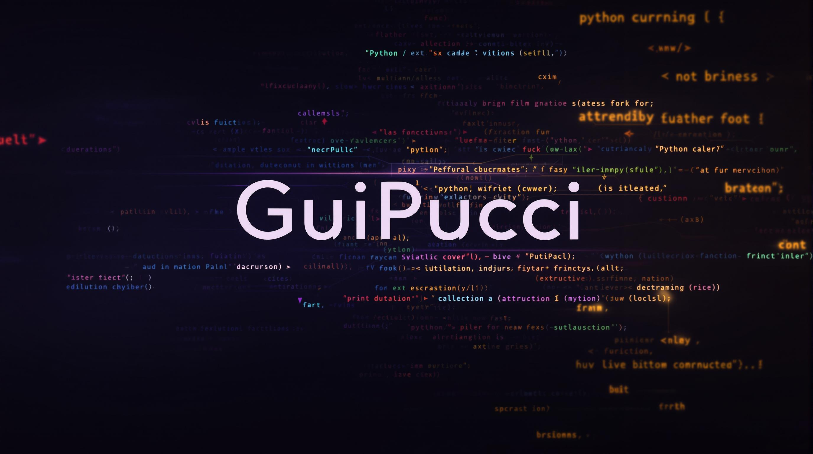

  

  
  

---

## 👨‍🎓 Sobre mim

- 🎓 **Formação:** Engenharia Civil - FMU
- 💻 **Transição de carreira:** Iniciando no mundo da programação, com foco em backend.
- 🌈 **Tecnologias favoritas:** Python, Git, GitHub
- 🌍 **Idiomas:** Português (fluente), Inglês (intermediário), Espanhol (básico)

---

## 🚀 Projetos em destaque

- [organizador_arquivos](https://github.com/GuiPucci/organizador_arquivos): Organizador automático de arquivos por extensão  
- [encontrar_duplicatas](https://github.com/GuiPucci/encontrar_duplicados): Localizador e agrupador de arquivos duplicados  
- [MyLVC](https://github.com/GuiPucci/My_Local_Version_Control): Controle de versão local didático em Python

<<<<<<< HEAD
---

## 🎓 Cursos e Certificações
=======
## Cursos:

➡️ Bootcamp Microsoft 50 Anos - Prompts Inteligentes :
    [Certificado](https://hermes.dio.me/certificates/JURKRNPL.pdf)

➡️ Formação Github Certification:
    [Certificado](https://hermes.dio.me/certificates/RAD2YLT2.pdf)

➡️ Curso Introdução à programação com Python
    [Certificado](https://hermes.dio.me/certificates/ZBOTQXWU.pdf)
>>>>>>> 511c06e336827556a9e6be77201810370d2f8f1f

- 🧠 **Bootcamp Microsoft 50 Anos - Prompts Inteligentes**  
  [Ver Certificado](https://hermes.dio.me/certificates/JURKRNPL.pdf)

- 🛡️ **Formação Github Certification**  
  [Ver Certificado](https://hermes.dio.me/certificates/RAD2YLT2.pdf)

- 🐍 **Introdução à programação com Python**  
  [Ver Certificado](https://hermes.dio.me/certificates/ZBOTQXWU.pdf)

---

## 📫 Como me encontrar

- [LinkedIn](https://www.linkedin.com/in/guilhermepucci/)
- [E-mail](mailto:guilhermepucci.eng@gmail.com)

---

**Obrigado por visitar!**  
Sinta-se à vontade para explorar meus repositórios, abrir issues ou sugerir melhorias.  
Vamos construir juntos soluções criativas! 🚀
